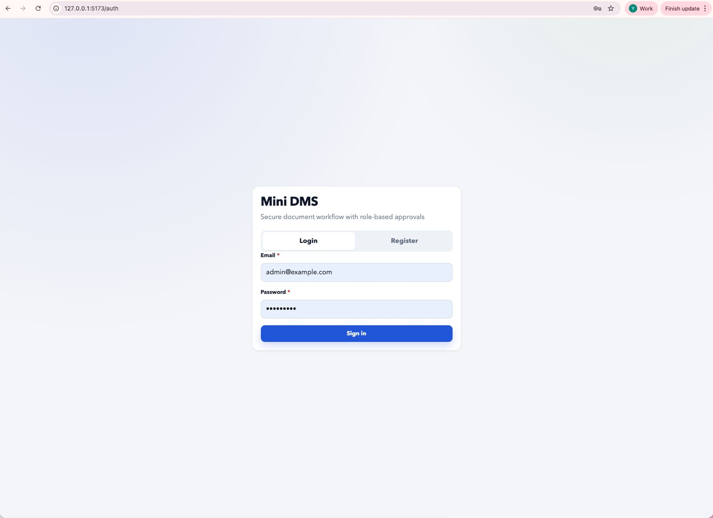
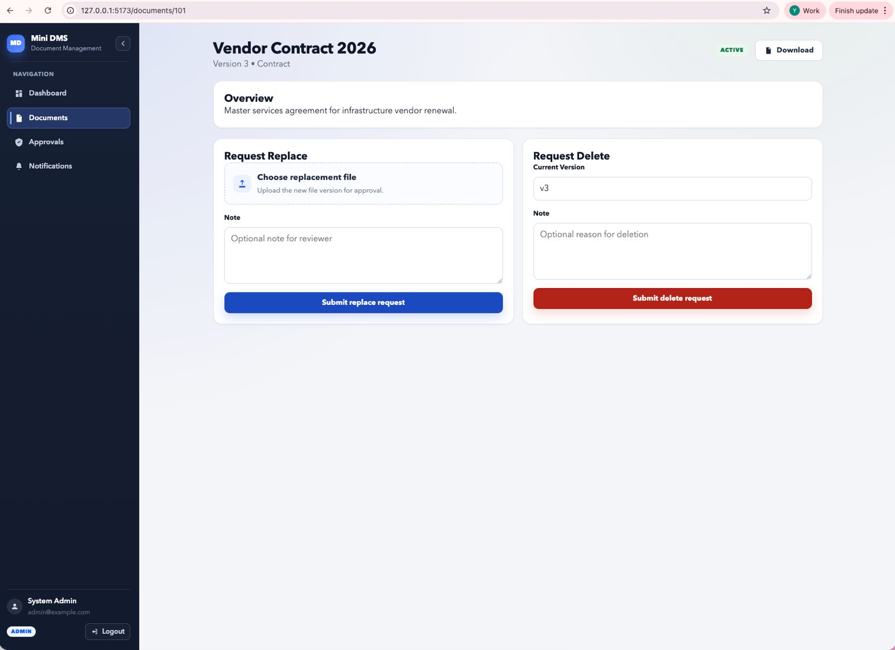

# Mini Document Management System (DMS)

A fullstack enterprise-style Document Management System built as part of a Software Engineer (Mid-Level) technical assessment.

This system simulates a real-world document workflow including authentication, role-based access control, document versioning, approval workflow, and notification handling.

---

# 🚀 Tech Stack

## Backend
- FastAPI
- SQLAlchemy
- Alembic (Database Migration)
- PostgreSQL
- JWT Authentication
- Clean Architecture (Router → Service → Repository)

## Frontend
- React + Vite + TypeScript
- Axios
- Protected Routes
- Modular Component Structure

## DevOps
- Docker & Docker Compose
- Environment-based configuration

---

# 📂 Project Structure

```
mini-dms/
 ├── backend/
 │    ├── app/
 │    │    ├── api/
 │    │    ├── core/
 │    │    ├── models/
 │    │    ├── repositories/
 │    │    ├── schemas/
 │    │    ├── services/
 │    │    └── main.py
 │    ├── alembic/
 │    ├── scripts/
 │    ├── tests/
 │    └── requirements.txt
 │
 ├── frontend/
 │    ├── src/
 │    │    ├── components/
 │    │    ├── pages/
 │    │    ├── layouts/
 │    │    └── api/
 │
 ├── docs/
 │    └── screenshots/
 │
 ├── docker-compose.yml
 └── README.md
```

---

# 🔐 Features

## Authentication
- User registration
- User login
- JWT protected APIs
- Role-based access control (USER, ADMIN)

## Document Management
- Upload document
- Search & filter documents
- Pagination support
- View document details
- Replace document (versioning supported)
- Delete document
- Document status tracking:
  - ACTIVE
  - PENDING_DELETE
  - PENDING_REPLACE

## Permission Workflow
- Replace/Delete requires admin approval
- Document is locked during pending request
- Admin can approve or reject request
- Transaction-safe database operation

## Notification System
- Database-stored notifications
- Mark as read
- Role-based notifications
- Workflow-triggered alerts

---

# 🖥 UI Preview

## Login


## Register


## Dashboard


## Documents


## Upload Document


## Replace / Delete Workflow


## Approval Page


## Notifications


---

# ⚙️ How to Run

## 1️⃣ Clone Repository

```
git clone https://github.com/sitisolehahyr/mini-dms.git
cd mini-dms
```

---

## 2️⃣ Run with Docker

```
docker compose up --build
```

Backend:
http://localhost:8000

Frontend:
http://localhost:5173

---

## 3️⃣ Run Database Migration

```
docker compose exec backend alembic upgrade head
```

---

## 4️⃣ Seed Admin User

```
docker compose exec backend python scripts/seed_admin.py
```

Default admin credentials:

- Email: admin@example.com  
- Password: admin123

---

# 🧠 System Design Considerations

## 1. Handling Large File Uploads
- Stream-based file handling to avoid memory overload
- In production, object storage such as AWS S3 or MinIO should be used
- Only metadata is stored in the database

## 2. Preventing Lost Updates
- Document locking when status is PENDING_DELETE or PENDING_REPLACE
- Version incrementing mechanism
- Transaction-safe replace/delete operations using database transactions

## 3. Scalable Notification System
- Indexed notification table per user
- Can be migrated to event-driven architecture
- Future-ready for message queue integration (e.g., Kafka, RabbitMQ)

## 4. Secure File Access
- JWT authentication middleware
- Role-based route protection
- Controlled file-serving endpoints

## 5. Microservice Readiness
- Clear separation between layers
- Repository and service abstraction
- Modular design allows separation into:
  - Auth service
  - Document service
  - Notification service

---

# 🧪 Testing

- Pytest for backend testing
- Role-based access validation
- Transaction integrity checks
- Workflow approval testing

---

# ✨ Notes

This project was built locally with focus on:

- Clean architecture
- Production-style workflow handling
- Transaction safety
- Maintainability and scalability
- Clear separation of concerns

---

# 👩‍💻 Author

Siti Solehah Yunita  
Software Engineer
